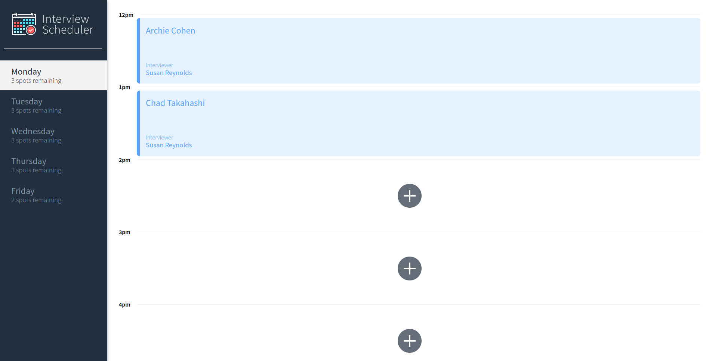
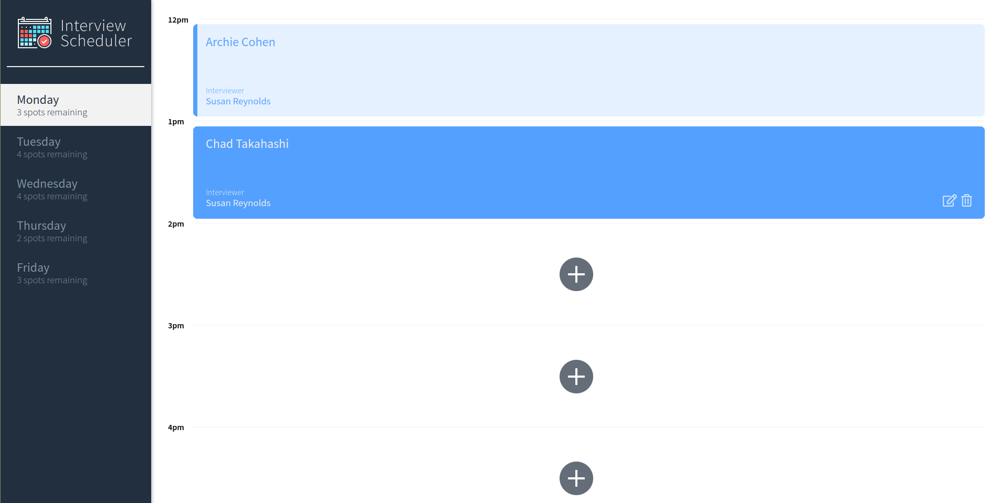
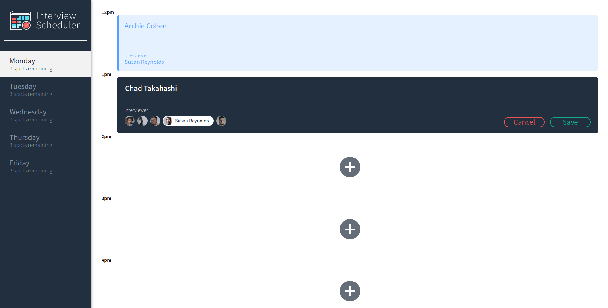
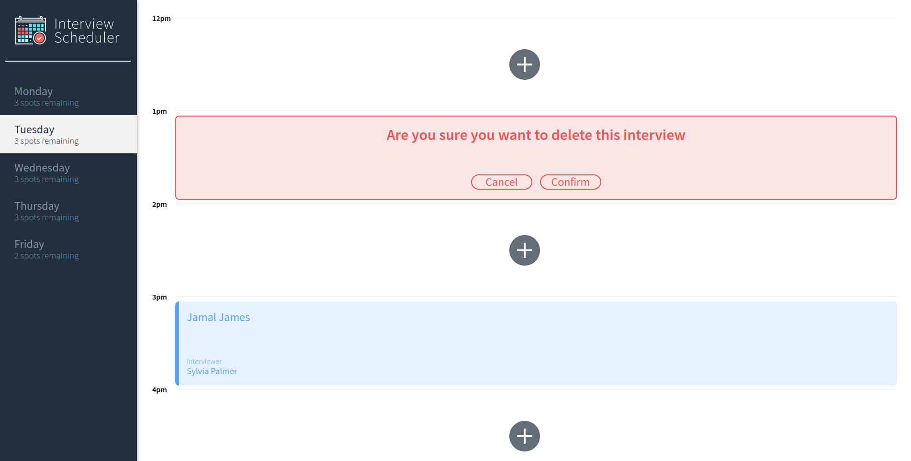

# Interview Scheduler

A simple app used to schedule interviews, built with React. 


This app has been deployed with Netlify and can be viewed [here](https://zen-fermi-191bfc.netlify.app/)

## Setup

Install dependencies with `npm install`.

## Running Webpack Development Server

```sh
npm start
```

## Running Jest Test Framework

```sh
npm test
```

## Running Storybook Visual Testbed

```sh
npm run storybook
```
# Screenshots

## Interview Schedule


## Interview Appointment


## Create and Edit Form


## Delete Confirmation

